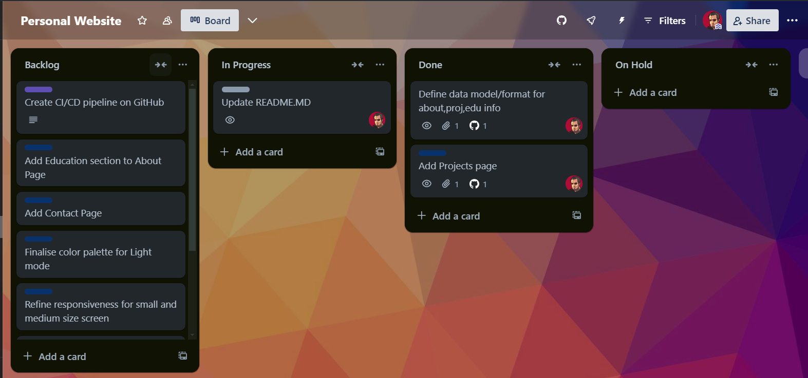

# Personal Website

A simple personal website built with SvelteKit.

## Technologies

- SvelteKit
- TailwindCSS
- TypeScript
- Vite
- Netlify
- Playwright

## Project Diary

### 05/11/2024

Creating a personal website from scratch using SvelteKit. Reasons:
- Previous iteration was quite old
- I wanted to learn Svelte/SvelteKit.
  
No grandiose or unique design ideas for this version, so I've started simple and clean. Basic structure with an `about`, `projects` and `contacts` page, dark/light mode switch, responsiveness etc.

I would still like to create a gamified version of it, in the style of a 2D SNES RPG game with pixel graphics and all. I could have both and ask users which one they would like to enter upon landing on the homepage. I will probably start working on that once completed this one.

Keeping track of my tasks and progress on a Trello board. The idea was to make it public and shareable, but I didn't realise I'd need a paid subscription to do that. That's beyond annoying. I'll probably just use GitHub projects next time.
